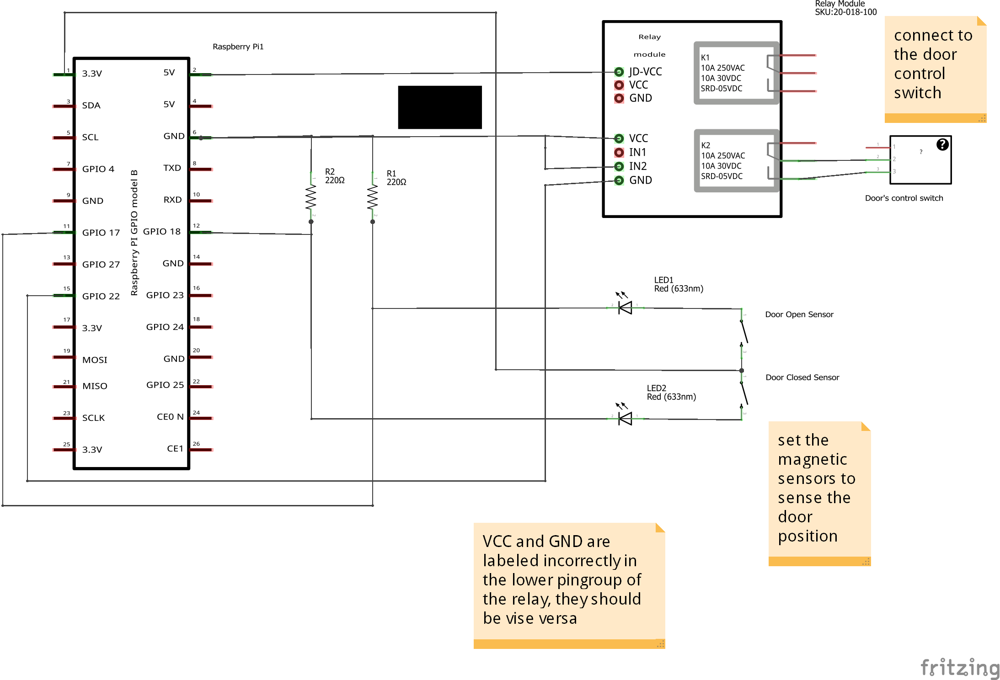

# Garage Door Opener with Raspberry Pi

Application to operate garage door from the web(mobile). The system has two key components.

- HTML5 application that the users uses to operate the door
- [NodeJS](http://nodejs.org) server running on the [RaspberryPi](http://en.wikipedia.org/wiki/Raspberry_Pi) and controlling the door via a relay, using the General Purpose I/O pins (GPIO) in the [Raspi](http://en.wikipedia.org/wiki/Raspberry_Pi).

The UI looks like this:

 
## Techniques and Tools
The following technologies are used:

### HTML5 Application
- [AngularJS](https://angularjs.org/). The web application is built as a simple angular application. The application makes REST calls to the server when it tries to operate the door. The request is sent as POST which includes the [IMEI](http://en.wikipedia.org/wiki/International_Mobile_Station_Equipment_Identity) of the device and the [keycode](), the user has punched in.
- [Bootstrap](http://getbootstrap.com/). Since I suck on CSS, why not use something that is readily available.
- [Socket.io](http://socket.io/). An easy to use websocket implementation. The sockets are used to communicate the state of the door ('open', 'closed', 'moving') to the application asyncronously.

### Server
- [NodeJS](http://nodejs.org). A Node server runnin on the Raspi.
- [Express](http://expressjs.com) web application framework for node
- [Socket.io](http://socket.io/) server side node implementation (sudo npm install socketio), for the asyncronous door state communication 
- [onoff](https://github.com/fivdi/onoff) node module (sudo npm install onoff) to control the [GPIO pins](http://www.hobbytronics.co.uk/raspberry-pi-gpio-pinout) of the Raspberry PI.

### Other tools
- [GPIO Admin](https://github.com/quick2wire/quick2wire-gpio-admin) to manage access  to the GPIO pins.

### Hardware
The following or similar hardware is needed. I've included approximate prices for the hardware.

- 1 * [RaspberryPI](http://www.adafruit.com/products/998). I've used model B, but model A should work as well ($39)
- 1 * WiFi USB adapter e.g. [Dlink Wireless N150 Pico USB Adapter](http://www.dlink.com/us/en/home-solutions/connect/adapters/dwa-121-wireless-n-150-pico-usb-adapter) ($15)
- 1 * Relay. I've used this [2-Channel 5V Relay Module for Arduino](http://www.sainsmart.com/arduino-pro-mini.html). Doesn't need to be 2 channel, since only one relay is needed. ($4)
- 1 * red led (optional) to indicate that the door is closed (or the sensor thinks that the door is closed ($0.10)
- 1 * green led (optional) to indicate that the door is open (or the sensor thinks that the door is open ($0.10)
- 2 * 220 ohm resistors (only if you use the leds) ($0.10)
- 1 * universal PCB board e.g. like [this](http://hobbycomponents.com/index.php/prot/prot-pcb/diy-pcb-universal-prototyping-board-5x7cm.html) ($3)
- 2 * Magnetic reed switch like [these](http://www.ebay.com/itm/331082143118) to indicate the door position
- jumper wires
- soldering iron + solder
- casing for rapberry ($8)
- casing for the board ($2)  
 

## wiring

A Frizing schema can be found in [Hardware](./hardware) folder

## Getting Started
Login to the Raspi

	login:pi
	password: raspberry (default)

cd to the directory where you got the code (assuming garage)

install nodejs [here](http://joshondesign.com/2013/10/23/noderpi) is an excellent guide how to

Install socket.io using the Node package manager (npm)  

	npm install socketio 

Install onoff  

	npm install onoff 

Install and configure GPIO Admin. Instructions are [here](https://github.com/quick2wire/quick2wire-gpio-admin#installation)
	
Allow the server access the GPIO pins by running export on the pins

	gpio-admin export 18
	gpio-admin export 17
	gpio-admin export 22
	
Then you should be able to run the server, however please make sure you are using the correect driver for the door. See the [note](#driver):

	node garage-server.js 

You should now be able to http://127.0.0.1:3000 (or the Raspi's IP) and get the keypad. If you also have already wired the sensors and the relay together, you should be able to punch in the code (default: 00000) and then click the check-mark. If everything is correctly done, the relay should click, and click again after 4 seconds. At least my garage door requires that when you open or close the door you need to press the button for a few seconds. That's why the relay is on for 4 seconds.

After the you stop the server it is good practise to unexport the pins

	gpio-admin unexport 18
	gpio-admin unexport 17
	gpio-admin unexport 22

## Application Directory Layout

    app/                --> all files related to the HTML5 application
      css/              --> css files
        app.css         --> styles, specific to this application
      img/              --> image files
      js/               --> javascript files
        app.js          --> application
        controllers.js  --> application controllers
        directives.js   --> not used
        filters.js      --> not used
        services.js     --> REST and socket.io services to back-end communication 
      partials/         --> views
        keypad.html     --> keypad, the only view 
      index.html        --> app layout file (the main html template file of the app)
	
	door/               --> door driver modules
	  garage_door_driver.js  		--> GPIO code (onoff) to operate the door
	  garage_door_driver_dummy.js  	--> for test  purposes, when not developing on Raspberry Pi

	hardware/			--> fritzing schema for required wiring

	garage-server.js	--> the server. Select here which door driver to use (real or dummy)
	README.md			--> this file

## Making the server run forever with forever
Install [forever](https://github.com/nodejitsu/forever). Forever is a tool that keeps your server running and restarts it if necessary

	sudo -i npm install forever -g

Test run your nodeJS server app:

	forever start /garage/garage-server.js

See that the server is running:

	forever list

Stop the server:

	forever stop 0  // the 0 is the index of the process from the list 

Modify the crontab to start forever at boot time:

	sudo crontab -u pi -e

Add the following to the end of the file:

	@reboot /bin/sh /home/pi/garage.sh

garage.sh is a script file in the user's (pi) home directory that should contain something like this:

	#!/bin/sh
	# Running Garage Door Server
	export NODE_ENV=production
	export PATH=/usr/local/sbin:/usr/local/bin:/usr/sbin:/usr/bin:/sbin:/bin:/opt/node/bin:$PATH
	echo "Starting Garage Door Server"
	echo "unexporting GPIO pins (errors expected)"
	gpio-admin unexport 18
	gpio-admin unexport 17
	gpio-admin unexport 22
	echo "exporting GPIO pins"
	gpio-admin export 18
	gpio-admin export 17
	gpio-admin export 22
	cd /home/pi/garage
	forever start garage-server.js

## Notes and trouble shooting
####Running the correct driver [driver]####
If you are running the server in other environment than Raspberry (e.g. for test / development purposess) the make sure that you have commented out the correct line from _garage-server.js_ file

	// This is for testing against dummy interface module
	var door = require('./door/garage_door_driver_dummy'); // Comment out when running on raspberry
	//var door = require('./door/garage_door_driver'); // Comment out when NOT running on raspberry

####Getting the device IMEI
Getting the IMEI from the device is not implemented yet. The getIMEI() function returns same IMEI for all devices. This will require a native or a Phonegap App to work.

####Changing the code
You can change the code, the server accept by modifying the VALID_CODE variable in the [garage-server.js](./garage-server.js) file. The default code is 00000.
